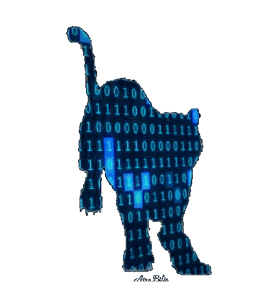

  
  
### Welcome on my Github Profile 💻
  <h1></h1>
  

- 👋 Hi, I’m *@salomon-dhn*
- 👀 I am interested in development, networking, science, security, cloud, microcontroller programming and general culture.
- 🌱 I am learning computer and telecom network architecture.
- 💞️ I'm looking to collaborate on open-source projects.
- 📫 You can reach me on [LinkedIn][lien] or my [Portfolio][portfolio]

> *_Increasing knowledge of yesterday_*

 

You can see below, a general overview of my hard skills :

 

- Programming languages & Framework

    &nbsp;
    &nbsp;
    &nbsp;
    &nbsp;
    &nbsp;
    &nbsp;
    &nbsp;  
    &nbsp;
    &nbsp;
    &nbsp;
    &nbsp;
 

 
 

- Operating System (OS) environment

    &nbsp;
    &nbsp;
    &nbsp;
    &nbsp;
    &nbsp;
    &nbsp;    
    &nbsp;

 

- Databases

    &nbsp;
    &nbsp;

 

- Other

    &nbsp;
    &nbsp;
    &nbsp;
    &nbsp;
    &nbsp;
    &nbsp;
    &nbsp;
    &nbsp;    
    &nbsp;

[lien]:https://www.linkedin.com/in/1sal/
[portfolio]:https://portfolio.itressources.xyz
<!---
salomon-dhn/salomon-dhn is a ✨ special ✨ repository because its `README.md` (this file) appears on your GitHub profile.
You can click the Preview link to take a look at your changes.
--->
